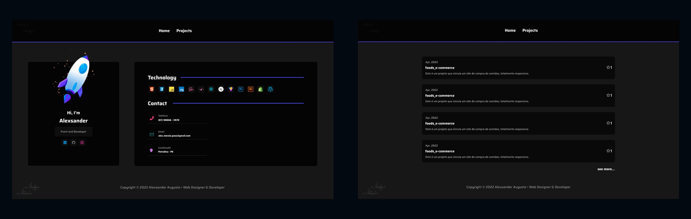
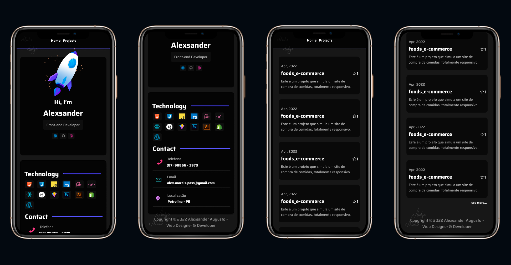

  

<h1 align="center">Alexsander Portfolio</h1>

<h3 align="center">
  
  
</h3>

## Overview | :book:

This is my personal portfolio to present my projects, you can check full prototypes assets at [Figma](https://www.figma.com/file/gesDTU7g1X2y23qUWk3RTx/Portfolio-design?node-id=0%3A1)

## Screenshots | 	:camera_flash:
### Desktop

---

### Mobile

## Techs | 🚀
- Javascript;
- React;
- Vite;
- Axios;
- Sass;
- Styled-Components;
- Github REST API.

## Deployment | :cloud:

- [Vercel](https://dev-alexsander.vercel.app/)

---

Copyright © 2022 Alexsander Augusto • Web Designer & Developer

